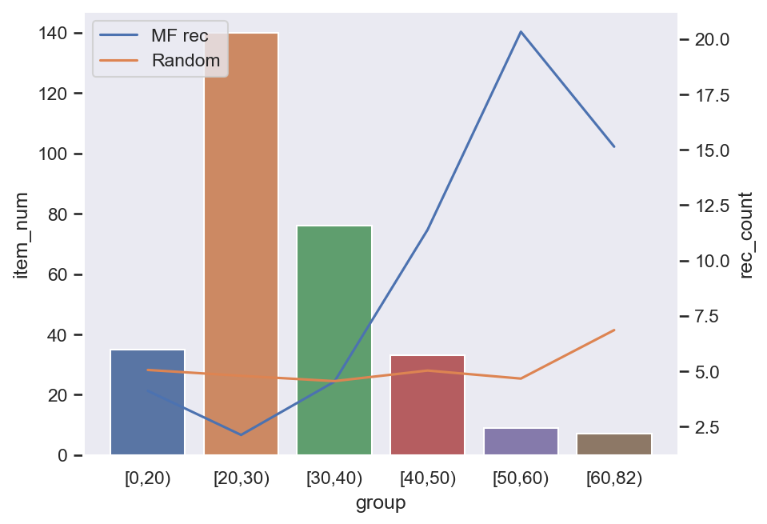
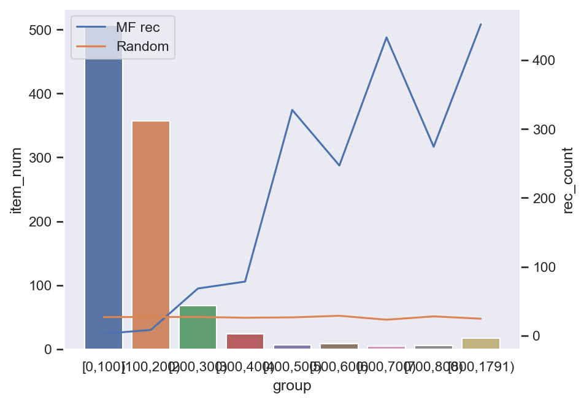
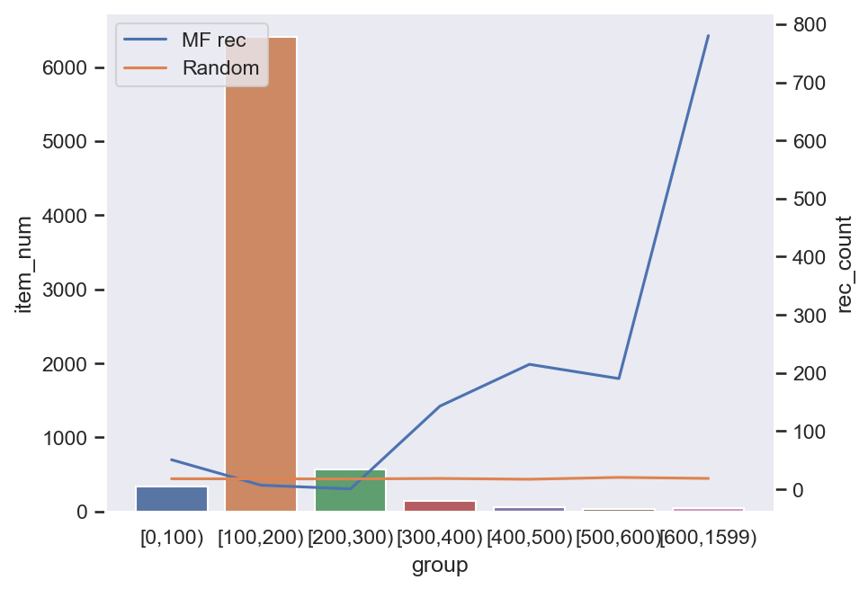
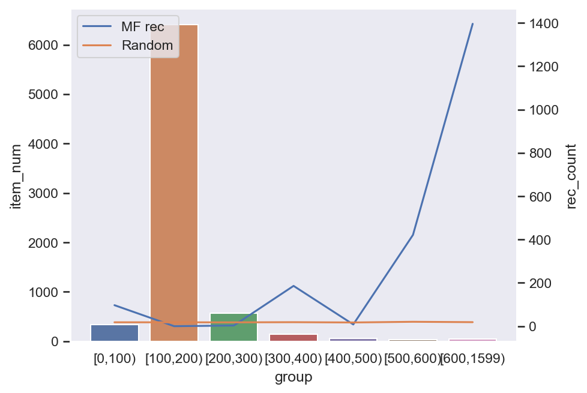
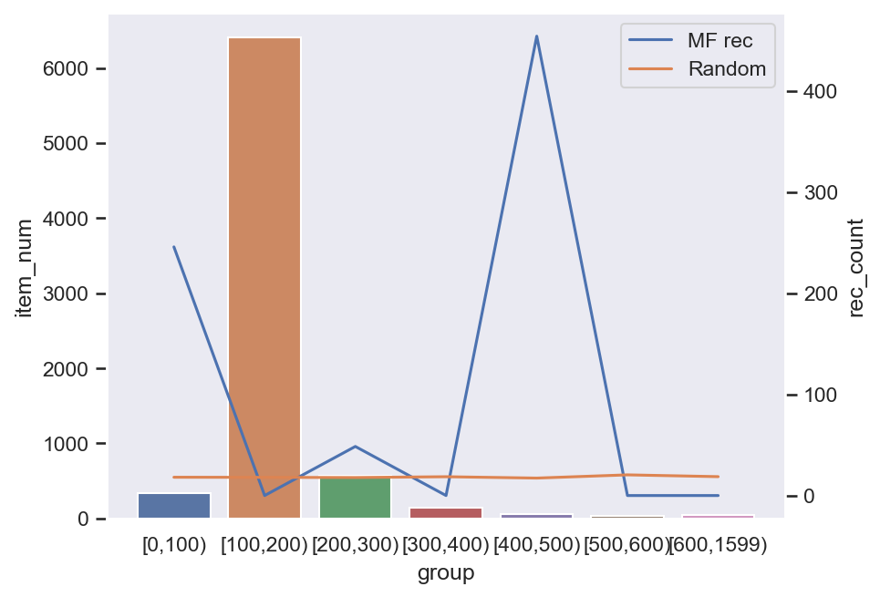

# MF-Pytorch
Matrix Factorization for Recommendation with Pytorch

## Algoritm

**Predicting** a rating:
$$ \hat r_{ui} = \mu + b_u + b_i + q_i^Tp_u$$

**Optimize** the model:
$$ \min \sum (r_{ui} - \mu - b_u - b_i - q_i^Tp_u) + \mathcal{L2}$$

## Usage

...

## Test

#### Coat

> py .\main.py --dataset=coat --num=10 --iter=40 --lr=1e-3 --l2=1e-5 --binary=True

test rmse: `0.392228`, random rmse: `0.563749`

#### Yahoo! R3

> py .\main.py --dataset=yahoo --num=50 --iter=30 --lr=1e-3 --l2=1e-4 --binary=True

test rmse: `0.388629`, random rmse: `0.575621`

> py .\main.py --dataset=yahoo --num=50 --iter=30 --lr=1e-3 --l2=1e-4 --binary=False
> 
test rmse: `1.141142`, random rmse: `2.166870`

#### KuaiRand

> py .\main.py --dataset=kuairand --key=is_click --num=50 --iter=50 --lr=1e-3 --l2=1e-5 --binary=True

test rmse: `0.382446`, random rmse: `0.577986`

> py .\main.py --dataset=kuairand --key=long_view --num=50 --iter=50 --lr=1e-3 --l2=1e-5 --binary=True

test rmse: `0.311767`, random rmse: `0.576226`

> py .\main.py --dataset=kuairand --key=is_like --num=50 --iter=50 --lr=1e-3 --l2=1e-5 --binary=True

test rmse: `0.080412`, random rmse: `0.576377`

